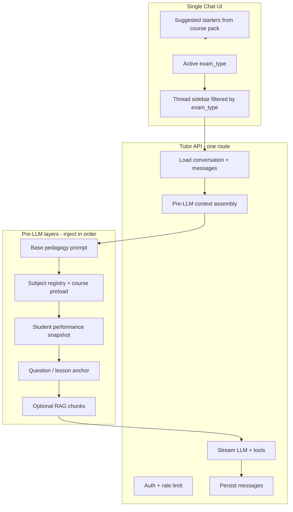

# Multi-Course AI Tutor Patterns — Research & Scholaris Architecture

**Date:** 2026-07-17  
**Scope:** Course-scoped AI tutors (Khanmigo, Duolingo Max, Studeia/Studi-like, LEA) and recommended architecture for Scholaris Scho.

---

## 1. Industry patterns (web research)

### 1.1 Khanmigo (Khan Academy)

| Pattern | Implementation |
|--------|----------------|
| **Course grounding** | RAG over Khan’s content library (articles, video transcripts, practice items). Prompts chain separate sections rather than one monolithic block. |
| **Account context** | Pulls enrolled courses, language, interests, and learner history into personalization. |
| **Pedagogy in prompt** | Socratic method baked into tone, question style, and guardrails — never direct answers for homework. |
| **Specialized agents** | Math agent for calculator-accurate steps; chain-of-thought for reasoning; content router for task type. |
| **Safety** | Moderation layer; parent/teacher alerts on policy violations. |

**Takeaway for Scholaris:** Separate **static pedagogy** (Scho base prompt) from **dynamic course facts** (preload) and **learner state** (scores, weak topics). Ground responses in owned content when possible (question bank, course research), not generic LLM knowledge.

Sources: [Khan Academy prompt engineering](https://blog.khanacademy.org/khan-academys-7-step-approach-to-prompt-engineering-for-khanmigo/), [Khanmigo overview](https://www.khanmigo.ai/), [Origins case study](https://originshq.com/blog/scaling-ai-at-khan-academy-case-study/)

---

### 1.2 Duolingo Max (Video Call / Roleplay)

| Pattern | Implementation |
|--------|----------------|
| **Layered system prompt** | **System** = pedagogy + personality + CEFR level + memory facts. **Assistant** = character voice. User messages stay user-only. |
| **Structured conversation phases** | Opener → first question → free conversation → programmatic closer (prevents infinite sessions). |
| **Mid-call evaluation** | System “whispers” meta-instructions each turn (confusion → rephrase; off-topic → redirect). |
| **Cross-session memory** | Post-call LLM extracts salient facts → stored as a **List of Facts** → reinjected into future System prompts (no fine-tuning, no vector DB required for basic memory). |
| **Stateless API** | Client holds `RoleplayState` (chat history + params); backend is stateless per request. Sessions are not resumed once left. |
| **Course alignment** | Human-authored scenarios aligned to learner’s position in the course; experts seed the first message and conversation arc. |

**Takeaway for Scholaris:** Use **phase hints** for empty-state starters and first-turn behavior. Consider a lightweight **course-scoped memory summary** (exam_type + user) updated after N turns. Keep API stateless; persist threads in Supabase.

Sources: [Duolingo AI video call blog](https://blog.duolingo.com/ai-and-video-call/), [Duolingo Max launch](https://blog.duolingo.com/duolingo-max/), [ZenML LLMOps case study](https://www.zenml.io/llmops-database/structured-llm-conversations-for-language-learning-video-calls)

---

### 1.3 Studeia / Studi-like (exam-prep SaaS)

| Pattern | Implementation |
|--------|----------------|
| **Multi-stage pipeline (pre-LLM)** | StudentModel → RetrievalAgent (tenant+course RAG) → PedagogicalAgent (strategy) → `buildEnrichedPrompt()` → LLM stream. |
| **Post-LLM background** | Evaluation (misconceptions), content follow-ups, supervisor moderation — fire-and-forget. |
| **Course isolation** | RAG filters `{ tenantId, courseId }`; never cross-cite another course. |
| **Per-course toggle** | `Course.aiTutorEnabled` at institution level. |
| **Enriched system prompt** | Course name, mastery per concept, active misconceptions, recent quiz context, retrieved chunks with `[Lesson X.Y]` citations. |

**Takeaway for Scholaris:** Scholaris already has the **orchestration skeleton** (preload + performance + question context). Phase 2 adds **RAG over question explanations / course-research markdown** and optional **background summarization**.

Sources: [Studeia multi-agent pipeline](https://docs.studeia.com/en/blog/multi-agent-ai-tutor-pipeline), [Studeia AI tutor overview](https://docs.studeia.com/en/features/ai-tutor/overview)

---

### 1.4 LEA (cross-course academic deployment)

| Pattern | Implementation |
|--------|----------------|
| **Orchestrator is course-agnostic** | Mastery tracker and scaffolding operate on abstract KC IDs, not course-specific code. |
| **Course-specific artifacts only** | New course = new RAG corpus + KC JSON model; **no orchestrator changes**. |
| **Scalability** | Same agent stack deployed across CS, psychology, etc. |

**Takeaway for Scholaris:** Treat `exam_type` as the **course key**. All course-specific behavior lives in **data artifacts** (`tutor-preload`, `planner-skills`, `course_units`, catalog) — not in chat UI code.

Source: [LEA arXiv paper](https://arxiv.org/html/2607.13370v1)

---

## 2. Cross-product pattern summary



| Concern | Common approach |
|--------|------------------|
| **One UI, many courses** | Active course selector drives `exam_type` on every thread + API call. |
| **Thread scoping** | `(user_id, exam_type, context_type[, context_id])` — never mix AP Calc and IB History in one thread. |
| **System prompt injection** | Layered: global pedagogy → course preload → session/performance → ephemeral RAG. |
| **Starters** | Course-specific templates referencing units, command terms, or weak areas — not generic chat prompts. |
| **Persistence** | Messages in DB; optional rolling summary or “facts list” per `(user, exam_type)`. |
| **Contextual chats** | Separate threads anchored to `question_id` or `lesson_id` (`context_type` + `context_id`). |

---

## 3. Scholaris data artifacts

### 3.1 `scripts/data/tutor-preload/{exam_type}.json`

**Purpose:** Compact **Scho system-prompt injection** for a single exam/course. Generated from course-research blueprints (`gen-wave-r-batch2.mjs` → `tutorPreload(bp)`).

**Typical fields:**

| Field | Role in prompt |
|-------|----------------|
| `exam_type`, `display_name` | Course identity |
| `units` / `units_summary` | Outline awareness (CED / IB topics) |
| `command_terms` | FRQ / IB verb discipline |
| `misconceptions` | Proactive coaching targets |
| `paper_rules` | Section-specific rules (MCQ A/B, Paper 1 vs 2) |
| `calculator_policy` | Section-level calculator/GDC rules |
| `scoring_notes` | Rubric / scale (1–5 AP, 1–7 IB) |
| `remix_cues` | Skill-generation hints (internal; optional in tutor) |
| `extra` | Freeform course notes |

**Runtime path:** `resolveCoursePreload()` in `src/lib/tutor/coursePreload.ts` reads the JSON file, formats a flat text block (`COURSE PRELOAD (...):`), and `buildTutorPrompt()` appends it to the subject registry block via `appendCoursePreload()`.

**Fallback chain:**

1. `scripts/data/tutor-preload/{exam_type}.json`
2. `SubjectConfig` from subject registry
3. `generateTutorPreloadBlock()` from `apIbCatalog`
4. Empty string

**Note:** JSON shapes vary slightly by generation wave (e.g. AP Calc uses `units_summary` + nested `calculator_policy`; IB Math uses flat `units[]`). `formatPreloadJson()` should be extended to normalize `units_summary` and structured calculator objects.

---

### 3.2 `scripts/data/planner-skills/{exam_type}.json`

**Purpose:** **Study planner & unit hub** structure — not injected into every tutor turn today.

**Typical fields:**

| Field | Used by |
|-------|---------|
| `units[]` (`unit_code`, `title`, `sort_order`) | `loadCourseUnits()` → dashboards, unit tests, planners |
| `skills[]` / `skillsByUnit` | Skill-level planning, practice launch |
| `topics[]` | Fallback unit list |
| `weekly_template_hints` | Plan generation copy |

**Runtime path:** `loadPlannerSkillsFile()` in `src/lib/dashboard/courseUnits.ts` — server-only filesystem read. Priority: **`course_units` DB table** → planner-skills JSON → catalog → static map.

**Relationship to tutor-preload:** Same blueprint source, different consumers:

- **tutor-preload** → LLM personality & exam rules (prompt)
- **planner-skills** → UI navigation, scheduling, skill IDs (product surface)

**Recommendation:** Use planner-skills **unit titles** and tutor-preload **misconceptions** jointly to generate **dynamic suggested starters** (see §5.3).

---

## 4. Current Scholaris implementation (baseline)

Scholaris already implements several best practices:

| Feature | Location |
|---------|----------|
| Single tutor page + sidebar | `src/app/dashboard/tutor/page.tsx` |
| Threads scoped by `exam_type` | `tutor_conversations.exam_type`, filtered by `useActiveExamType()` |
| Contextual threads | `context_type` (`general`, `question`, `lesson`, `exam_prep`) + `context_id` |
| Layered prompt | `PROMPTS.SCHO_TUTOR_BASE` + `buildTutorPrompt()` |
| Course preload injection | `/api/ai/tutor` → `resolveCoursePreload()` |
| Performance snapshot | `getTutorPerformanceData()` — scores, weak/strong topics |
| Question-anchored tutoring | `TutorChat` + `streamContext` from practice UI |
| Static AP/IB starters | `src/lib/tutor/suggestions.ts` |
| Message persistence | `tutor_messages`; last 8 turns in prompt |

**Gaps vs. industry patterns:**

1. Preload lives under `scripts/data/` (may be excluded from Vercel deploy — mirror catalog fix: bundle or sync to `src/data/` or DB).
2. Starters are generic per family (AP/IB), not per `exam_type` or weak units.
3. No rolling **course-scoped memory summary** (Duolingo facts list).
4. No **RAG** over owned question/course corpus (Khan/Studeia pattern).
5. `formatPreloadJson()` does not fully serialize rich fields (`units_summary`, nested calculator sections).
6. `subject_context` JSON column on `tutor_conversations` is unused — could store frozen preload version or unit focus.

---

## 5. Recommended architecture for Scholaris

### 5.1 Design principles

1. **One chat shell** — Same `TutorPage` / `TutorChat` components for SAT, ACT, AP, IB.
2. **Course = `exam_type`** — Thread list, starters, preload, and performance all keyed on active exam.
3. **Data-driven course behavior** — Adding AP Physics 2 should be JSON + catalog, not new React routes.
4. **Prompt layers are composable** — Base prompt unchanged; course packs swap per request.
5. **Contextual threads stay out of the main list** — General chats in sidebar; question/lesson chats open inline (already partially done).

---

### 5.2 Data model (Supabase)

**Existing tables (keep):**

```sql
tutor_conversations (
  id uuid PK,
  user_id uuid FK,
  exam_type exam_type NOT NULL,      -- course scope
  context_type text,                 -- general | question | lesson | exam_prep
  context_id text,                   -- question UUID, lesson id, etc.
  title text,
  subject_context jsonb DEFAULT '{}', -- see below
  created_at, updated_at
)

tutor_messages (
  id uuid PK,
  conversation_id uuid FK,
  role text CHECK (role IN ('user','assistant')),
  content text,
  created_at
)
```

**Recommended indexes:**

```sql
CREATE INDEX idx_tutor_conversations_user_exam_updated
  ON tutor_conversations (user_id, exam_type, updated_at DESC);

CREATE INDEX idx_tutor_conversations_user_context
  ON tutor_conversations (user_id, exam_type, context_type, context_id);
```

**Optional new table (phase 2 — course memory):**

```sql
tutor_course_memory (
  user_id uuid,
  exam_type exam_type,
  facts jsonb,           -- string[] extracted facts
  summary text,          -- rolling 2–3 sentence summary
  updated_at timestamptz,
  PRIMARY KEY (user_id, exam_type)
)
```

**Use `subject_context` on conversation create:**

```json
{
  "preload_version": "2026-07-17",
  "unit_focus": "U4_integration",
  "source": "dashboard_tutor"
}
```

---

### 5.3 API architecture

**Single streaming endpoint (keep):** `POST /api/ai/tutor`

**Request:**

```typescript
{
  conversation_id: string;
  message: string;
  context?: {
    exam_type: string;           // required — must match conversation.exam_type
    topic?: string;
    unit_code?: string;          // NEW — from planner-skills
    question_text?: string;
    // ... existing question fields
  };
}
```

**Server pipeline (ordered):**

```
1. Auth, CSRF, rate limit
2. Load conversation — verify user_id + exam_type match context.exam_type
3. Insert user message
4. Load last N messages (8 today; consider 12 for FRQ walkthroughs)
5. Parallel fetch:
   - getSubjectConfig(exam_type)
   - resolveCoursePreload(exam_type)      // tutor-preload JSON
   - getTutorPerformanceData(user, exam_type)
   - [phase 2] retrieveCourseRag(query, exam_type)
   - [phase 2] getTutorCourseMemory(user, exam_type)
6. buildTutorPrompt(base, {
     subjectConfig,
     coursePreload,
     performanceData,
     questionContext,
     conversationContext,
     courseMemory,                        // phase 2
     ragChunks,                           // phase 2
   })
7. streamWithTools(system, messages, tools)
8. Persist assistant message; touch conversation.updated_at
9. [async] update course memory / misconception log
```

**New read endpoints (recommended):**

| Route | Purpose |
|-------|---------|
| `GET /api/tutor/starters?exam_type=` | Return 5–8 suggested prompts from preload + weak topics |
| `GET /api/tutor/conversations?exam_type=` | List threads (optional — client can keep using Supabase directly) |

**Validation rule:** Reject or warn if `context.exam_type !== conversation.exam_type` to prevent cross-course prompt leakage.

---

### 5.4 Prompt assembly (layers)

```
┌─────────────────────────────────────────────────────────────┐
│ Layer 0: SCHO_TUTOR_BASE (global pedagogy, Desmos, safety)   │
├─────────────────────────────────────────────────────────────┤
│ Layer 1: Subject registry (sections, score range, formats) │
├─────────────────────────────────────────────────────────────┤
│ Layer 2: COURSE PRELOAD (tutor-preload/{exam_type}.json)    │
│          units, command terms, misconceptions, paper rules    │
├─────────────────────────────────────────────────────────────┤
│ Layer 3: STUDENT PROFILE (performance snapshot — no re-ask) │
├─────────────────────────────────────────────────────────────┤
│ Layer 4: SESSION ANCHOR (question / lesson / unit_focus)    │
├─────────────────────────────────────────────────────────────┤
│ Layer 5: COURSE MEMORY (optional facts summary)             │
├─────────────────────────────────────────────────────────────┤
│ Layer 6: RAG CONTEXT (optional retrieved chunks + citations)│
└─────────────────────────────────────────────────────────────┘
```

Implement Layer 5 with Duolingo’s pattern: after every K messages (or on conversation idle), run a cheap model pass: *“What should Scho remember about this student in {course}?”* → merge into `tutor_course_memory.facts` (cap at ~20 bullets).

---

### 5.5 Component architecture

```
src/app/dashboard/tutor/
  page.tsx                    # Shell: sidebar + chat (exam-scoped)
  [conversationId]/page.tsx   # Deep link to one thread

src/components/tutor/
  TutorChat.tsx               # Embeddable chat (practice, lessons)
  TutorConversationList.tsx
  TutorChatInput.tsx
  TutorSuggestedStarters.tsx  # NEW — fetches /api/tutor/starters

src/hooks/
  useActiveExamType.ts        # Course switch → reload threads + starters
  useTutorStream.ts           # SSE client

src/lib/tutor/
  coursePreload.ts            # Load + format tutor-preload
  suggestions.ts              # Migrate to dynamic starters helper
  performance.ts
  buildStarters.ts            # NEW — merge preload + weak topics + units
  queries.ts
```

**Course switch behavior:**

1. User changes active exam in header/settings.
2. `TutorPage` clears active thread, reloads `conversations WHERE exam_type = active`.
3. Starters + greeting refresh via `tutorExamLabel()` / new starter API.
4. No code fork per course — only data changes.

**Embeds:** `TutorChat` with `contextType="question"` + `contextId={questionId}` + `streamContext={...}` — separate thread per question, excluded from main sidebar (already intended).

---

### 5.6 Suggested starters (recommended algorithm)

Replace static `tutorSuggestions()` for AP/IB with:

```typescript
function buildStarters(input: {
  displayName: string;
  units: CourseUnit[];           // from course_units / planner-skills
  misconceptions: string[];      // from tutor-preload
  weakTopics?: string[];         // from performance
}): TutorSuggestion[] {
  // Priority mix:
  // 1. Weak topic + command term ("Explain chain rule for FRQ part (b)")
  // 2. Unit quiz ("Quiz me on {unit.title}")
  // 3. Misconception ("Why is '{misconception}' wrong?")
  // 4. Exam mechanics ("Walk me through Paper 2 GDC strategy")
  // 5. Study plan hook ("What should I focus on this week?")
}
```

Expose via `GET /api/tutor/starters` so client and server share one implementation. Cache per `(exam_type, weakTopics hash)` for 5 minutes.

---

### 5.7 Deployment: preload & planner packs

| Option | Pros | Cons |
|--------|------|------|
| **A. `src/data/tutor-preload/`** | Vercel-safe, versioned with app | Larger repo; regen must copy |
| **B. `course_preload` DB table** | Editable without deploy; single source | Migration + admin UI |
| **C. Supabase Storage JSON** | Good for 100+ courses | Extra fetch latency |

**Recommendation:** Short term **A** (mirror `ap-ib-course-catalog` fix). Long term **B** for non-engineer edits, fed by the same blueprint pipeline that writes `scripts/data/tutor-preload/` today.

---

### 5.8 Phase roadmap

| Phase | Deliverable |
|-------|-------------|
| **P0 (now)** | Document + normalize `formatPreloadJson()` for `units_summary` / calculator sections |
| **P1** | Dynamic starters from tutor-preload + `course_units`; `exam_type` mismatch guard on API |
| **P1** | Bundle tutor-preload under `src/data/` or sync to DB for production |
| **P2** | `tutor_course_memory` + post-turn summarizer |
| **P2** | RAG: embed `course-research/*.md` + question explanations filtered by `exam_type` |
| **P3** | Pedagogical strategy selector (hint vs. Socratic vs. worked example) from mastery |
| **P3** | Background moderation / misconception tagging (Studeia-style) |

---

## 6. API & component recommendation (executive summary)

**Keep one chat UI and one streaming API.** Scope all tutor state by **`exam_type`** at the thread level. On each turn, assemble the system prompt from fixed layers: global Scho pedagogy → subject registry → **`tutor-preload/{exam_type}`** → live performance data → optional question/lesson anchor → (later) course memory and RAG.

**Components:** `TutorPage` + `TutorChat` stay generic; course flavor comes from `useActiveExamType()`, `resolveCoursePreload()`, and a new **`TutorSuggestedStarters`** fed by tutor-preload + planner-skills units + weak topics.

**Data:** Continue generating **`tutor-preload`** and **`planner-skills`** from course-research blueprints; converge preload delivery to a deploy-safe path (`src/data` or DB). Use **`planner-skills`** for unit-aware starters and planner UI; use **`tutor-preload`** exclusively for LLM course rules.

**Threads:** Persist under `(user_id, exam_type, context_type, context_id)`; list only `general` chats in the main tutor sidebar; keep question-scoped chats embedded in practice flows.

This matches Khanmigo’s layered prompts + learner context, Duolingo’s course-aligned starters and memory, Studeia’s enriched prompt assembly, and LEA’s course-agnostic orchestrator with swappable course packs — without multiplying chat UIs per AP/IB course.

---

## 7. Key file references (Scholaris)

| File | Role |
|------|------|
| `src/app/api/ai/tutor/route.ts` | Tutor SSE API |
| `src/lib/promptBuilder.ts` | Prompt layer assembly |
| `src/lib/tutor/coursePreload.ts` | tutor-preload loader |
| `src/lib/dashboard/courseUnits.ts` | planner-skills / course_units loader |
| `src/lib/tutor/suggestions.ts` | Starters & greetings |
| `src/lib/tutor/performance.ts` | Student profile for prompt |
| `src/app/dashboard/tutor/page.tsx` | Main multi-thread chat UI |
| `scripts/data/tutor-preload/*.json` | Per-exam Scho preload packs |
| `scripts/data/planner-skills/*.json` | Per-exam unit/skill planner packs |
| `scripts/data/.ap-ib-regen/gen-wave-r-batch2.mjs` | Blueprint → preload + planner generator |
