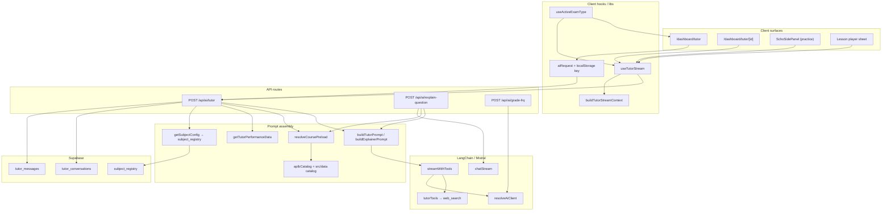

# Scholaris AI Tutor / Chat Infrastructure Audit

**Date:** 2026-07-17  
**Scope:** Scho tutor UI, LangChain/Mistral backend, AP/IB catalog + preload, chat/explain/grade API routes, and extension points for per-course GetStudi-style chatbots across all AP/IB courses.

---

## Executive summary

Scholaris uses a **single tutor persona (“Scho”)** with **exam-scoped conversations**. Course specificity is injected at prompt-build time via:

1. `exam_type` from the active subject switcher or question context  
2. `subject_registry` rows (Supabase)  
3. Per-course preload JSON under `scripts/data/tutor-preload/` (109 files today)  
4. Fallback text from `src/lib/apIbCatalog.ts` + `generateTutorPreloadBlock()`

The main tutor path is **SSE streaming** through `/api/ai/tutor` using LangChain tool-calling (`web_search`). Explain and FRQ grading use separate routes with lighter prompts.

**Critical production gap:** `scripts/data/**` is in `.vercelignore`, so **tutor-preload JSON is not deployed to Vercel**. Production falls back to catalog-generated blocks unless preload is moved under `src/` (same pattern as `ap-ib-course-catalog.json`).

**Catalog coverage:** 105 primary AP/IB courses + 4 legacy aliases; 109 preload JSON files (includes legacy `AP_COMPUTER_SCIENCE`, `AP_ECONOMICS`, `AP_ENGLISH`, `AP_PHYSICS`).

---

## Architecture diagram



---

## File map

### Dashboard tutor pages

| Path | Role |
|------|------|
| `/Users/yatishgrandhe/Downloads/scholaris-main/src/app/dashboard/tutor/page.tsx` | Full-page Ask Scho: conversation sidebar, streaming via `aiRequest`, scoped by `activeExamType`, filters `context_type` general/null |
| `/Users/yatishgrandhe/Downloads/scholaris-main/src/app/dashboard/tutor/[conversationId]/page.tsx` | Deep-linked conversation view; uses `useTutorStream` + `TutorConversationList` |
| `/Users/yatishgrandhe/Downloads/scholaris-main/src/app/dashboard/tutor/loading.tsx` | Route loading shell |

### Tutor components

| Path | Role |
|------|------|
| `/Users/yatishgrandhe/Downloads/scholaris-main/src/components/tutor/TutorChat.tsx` | Embeddable chat: creates/reuses conversation by `context_type` + `context_id`, streams via `useTutorStream` |
| `/Users/yatishgrandhe/Downloads/scholaris-main/src/components/tutor/TutorChatInput.tsx` | Composer |
| `/Users/yatishgrandhe/Downloads/scholaris-main/src/components/tutor/TutorMessageBubble.tsx` | Message bubble + `TutorMarkdown` |
| `/Users/yatishgrandhe/Downloads/scholaris-main/src/components/tutor/TutorMarkdown.tsx` | GFM + KaTeX rendering |
| `/Users/yatishgrandhe/Downloads/scholaris-main/src/components/tutor/TutorTypingIndicator.tsx` | Typing / “Searching the web…” indicator |
| `/Users/yatishgrandhe/Downloads/scholaris-main/src/components/tutor/TutorConversationList.tsx` | Sidebar list for `[conversationId]` route |
| `/Users/yatishgrandhe/Downloads/scholaris-main/src/components/tutor/tutor.module.css` | Shared tutor styles |

### Scho side panel (in-question tutor)

| Path | Role |
|------|------|
| `/Users/yatishgrandhe/Downloads/scholaris-main/src/components/exam/SchoSidePanel.tsx` | Ask Scho + Explanation tabs; embeds `TutorChat` with `contextType="question"` |
| `/Users/yatishgrandhe/Downloads/scholaris-main/src/components/exam/SchoSidePanel.module.css` | Panel layout (pinned dock vs floating modal) |
| `/Users/yatishgrandhe/Downloads/scholaris-main/src/components/exam/ExplanationSidePanel.tsx` | Static/step explanation tab; can seed Ask Scho prompts |
| `/Users/yatishgrandhe/Downloads/scholaris-main/src/app/dashboard/practice/[sessionId]/page.tsx` | Primary consumer of `SchoSidePanel` during practice |

### Other Scho embed points

| Path | Role |
|------|------|
| `/Users/yatishgrandhe/Downloads/scholaris-main/src/app/dashboard/courses/[courseId]/[lessonId]/page.tsx` | Lesson player: Sheet with `TutorChat` (`contextType="lesson"`) |
| `/Users/yatishgrandhe/Downloads/scholaris-main/src/components/question/AIExplainPanel.tsx` | One-shot streamed explanation via `/api/ai/explain-question` (not full tutor thread) |
| `/Users/yatishgrandhe/Downloads/scholaris-main/src/lib/dashboard/navConfig.ts` | Nav item `{ id: "scho", href: "/dashboard/tutor", label: "Ask Scho" }` |

### Client hooks & tutor lib

| Path | Role |
|------|------|
| `/Users/yatishgrandhe/Downloads/scholaris-main/src/hooks/useTutorStream.ts` | SSE client for `/api/ai/tutor`; handles `text` + transient `status` (web search) |
| `/Users/yatishgrandhe/Downloads/scholaris-main/src/hooks/useActiveExamType.ts` | `subjectStore.activeSubject ?? profile.exam_goal ?? "SAT"` |
| `/Users/yatishgrandhe/Downloads/scholaris-main/src/lib/tutor/queries.ts` | `fetchTutorConversations`, `createTutorConversation` |
| `/Users/yatishgrandhe/Downloads/scholaris-main/src/lib/tutor/questionContext.ts` | `TutorStreamContext`, `buildTutorStreamContext` from `Question` |
| `/Users/yatishgrandhe/Downloads/scholaris-main/src/lib/tutor/coursePreload.ts` | Loads per-exam preload JSON from disk; formats for system prompt |
| `/Users/yatishgrandhe/Downloads/scholaris-main/src/lib/tutor/performance.ts` | Student score/weak-topic snapshot for tutor system prompt |
| `/Users/yatishgrandhe/Downloads/scholaris-main/src/lib/tutor/suggestions.ts` | AP/IB-aware greeting, empty-state copy, starter suggestions |

### Prompts & catalog

| Path | Role |
|------|------|
| `/Users/yatishgrandhe/Downloads/scholaris-main/src/lib/aiPrompts.ts` | `SCHO_TUTOR_BASE`, `QUESTION_EXPLAINER`, other system prompts |
| `/Users/yatishgrandhe/Downloads/scholaris-main/src/lib/promptBuilder.ts` | `buildTutorPrompt`, `buildExplainerPrompt`; merges subject, preload, performance, question context |
| `/Users/yatishgrandhe/Downloads/scholaris-main/src/lib/apIbCatalog.ts` | Catalog helpers, `generateTutorPreloadBlock`, display names |
| `/Users/yatishgrandhe/Downloads/scholaris-main/src/data/ap-ib-course-catalog.json` | **Deployed** source of truth: 109 courses (40 AP primary + 4 legacy + 65 IB) |
| `/Users/yatishgrandhe/Downloads/scholaris-main/src/lib/subjectContext.ts` | `getSubjectConfig` → `subject_registry` table |

### AI / LangChain layer

| Path | Role |
|------|------|
| `/Users/yatishgrandhe/Downloads/scholaris-main/src/lib/ai/mistral.ts` | LangChain `ChatMistralAI` / `ChatOpenAI`; `streamWithTools`, `chatStream`, stop sequences |
| `/Users/yatishgrandhe/Downloads/scholaris-main/src/lib/ai/tools.ts` | LangChain `web_search` tool for tutor agent loop |
| `/Users/yatishgrandhe/Downloads/scholaris-main/src/lib/ai/webSearch.ts` | Tavily → DuckDuckGo fallback |
| `/Users/yatishgrandhe/Downloads/scholaris-main/src/lib/ai/keyPolicy.ts` | `resolveAiClient`: personal BYO key vs platform FreeModel key |
| `/Users/yatishgrandhe/Downloads/scholaris-main/src/lib/ai/clientKey.ts` | Browser localStorage key + `aiRequest` wrapper |
| `/Users/yatishgrandhe/Downloads/scholaris-main/src/lib/ai/frqGrading.ts` | Shared FRQ rubric formatting + AP/IB scale hints |
| `/Users/yatishgrandhe/Downloads/scholaris-main/src/lib/ai/aiKeyModes.ts` | Platform key mode settings |

### API routes (chat / explain / grade)

| Path | Role |
|------|------|
| `/Users/yatishgrandhe/Downloads/scholaris-main/src/app/api/ai/tutor/route.ts` | **Main tutor SSE** — auth, rate limit, persist messages, `buildTutorPrompt`, `streamWithTools` |
| `/Users/yatishgrandhe/Downloads/scholaris-main/src/app/api/ai/explain-question/route.ts` | One-shot question explanation SSE (`buildExplainerPrompt` + optional preload) |
| `/Users/yatishgrandhe/Downloads/scholaris-main/src/app/api/ai/grade-frq/route.ts` | Structured FRQ grading (LangChain + zod schema); AP/IB-aware system prompt |

Related AI routes (not full chat, but same key/policy stack):

- `/Users/yatishgrandhe/Downloads/scholaris-main/src/app/api/ai/generate-recommendations/route.ts`
- `/Users/yatishgrandhe/Downloads/scholaris-main/src/app/api/ai/remix/route.ts`
- `/Users/yatishgrandhe/Downloads/scholaris-main/src/app/api/ai/generate-study-plan/route.ts`

### Tutor preload & course research (build-time / local)

| Path | Role |
|------|------|
| `/Users/yatishgrandhe/Downloads/scholaris-main/scripts/data/tutor-preload/*.json` | **109 per-course preload files** (e.g. `AP_CALCULUS_AB.json`) — **not on Vercel** |
| `/Users/yatishgrandhe/Downloads/scholaris-main/scripts/data/course-research/*.md` | Human research notes per course |
| `/Users/yatishgrandhe/Downloads/scholaris-main/scripts/data/course-research/*.blueprint.json` | Unit/topic blueprints for question bank generation |

### Database

| Path | Role |
|------|------|
| `/Users/yatishgrandhe/Downloads/scholaris-main/supabase/migrations/20260517120000_dashboard_practice_tutor.sql` | Creates `tutor_conversations`, `tutor_messages`, RLS |
| `/Users/yatishgrandhe/Downloads/scholaris-main/src/types/supabase.ts` | Typed schema: `context_type`, `context_id`, `exam_type`, `subject_context` (unused in app code today) |

### Config / infra

| Path | Role |
|------|------|
| `/Users/yatishgrandhe/Downloads/scholaris-main/.vercelignore` | Excludes `scripts/data/**` — breaks preload at runtime in production |
| `/Users/yatishgrandhe/Downloads/scholaris-main/src/lib/rateLimit.ts` | `ai-tutor`: 100/hr; explain uses `generate-question`: 50/hr; `ai-grade-frq`: 60/hr |

---

## Data flow: main tutor turn

1. **User selects exam** via subject switcher → `useActiveExamType()` returns e.g. `AP_CALCULUS_AB`.
2. **UI sends message** with `conversation_id` + optional `context` (question stem, topic, options, etc.).
3. **`POST /api/ai/tutor`**:
   - CSRF + auth + rate limit
   - Validates conversation ownership
   - `resolveAiClient` (BYO Mistral or platform key)
   - Inserts user message to `tutor_messages`
   - Loads last 8 messages for history
   - Parallel fetch: `getSubjectConfig(exam_type)`, `getTutorPerformanceData(user, exam_type)`
   - `resolveCoursePreload(exam_type, subjectConfig)` — file → registry → catalog fallback
   - `buildTutorPrompt()` assembles system instruction
   - `streamWithTools()` with `tutorTools()` (web search), temp 0.6, max 650 tokens, 3 rounds
   - SSE tokens + optional `{ status: "Searching the web…" }`
   - Persists assistant reply; updates `tutor_conversations.updated_at`
4. **Client** appends streamed text; on done, shows full assistant message.

### Conversation scoping model

| Field | Purpose |
|-------|---------|
| `exam_type` | Which course/exam Scho assumes (AP/IB/SAT/ACT) |
| `context_type` | `general` \| `question` \| `lesson` \| `exam_prep` |
| `context_id` | Question UUID, lesson UUID, etc. — dedupes embed chats |
| `title` | Sidebar label; auto-set from first short user message |

General chats on `/dashboard/tutor` filter `context_type.is.null OR context_type.eq.general` so question-scoped threads do not appear in the main list.

---

## Data flow: explain vs grade

### Explain (`/api/ai/explain-question`)

- Triggered by `AIExplainPanel` after answer check (not a persistent thread).
- Builds a single user prompt via `buildExplainerPrompt`; appends course preload block for AP/IB.
- Uses `chatStream` (no tools), temp 0.4, max 500 tokens.
- Does **not** write to `tutor_messages`.

### Grade FRQ (`/api/ai/grade-frq`)

- Triggered from practice/exam shells for FRQ items.
- LangChain structured output (`gradeSchema`) with AP/IB display name + `frqGraderScaleHint`.
- Returns score, feedback, optional `rubric_scores`; client persists on `question_attempts`.

---

## AP/IB course specificity today

### Layer 1: Catalog (`src/data/ap-ib-course-catalog.json`)

- 105 non-legacy courses; each has `display_name`, `sections`, `question_mix`, `calculator_policy`, optional `tutor_blurb`.
- Imported by `apIbCatalog.ts` — **bundled in Vercel builds**.

### Layer 2: Subject registry (Supabase `subject_registry`)

- `getSubjectConfig()` supplies topics, sections, score ranges for prompt `SUBJECT_CONTEXT` block.
- Must be populated for each AP/IB `exam_type` for richest non-preload behavior.

### Layer 3: Tutor preload JSON (`scripts/data/tutor-preload/{exam_type}.json`)

Example fields (see `AP_CALCULUS_AB.json`):

- `command_terms`, `misconceptions`, `paper_rules`, `calculator_policy`, `units_summary`, `remix_cues`, `extra`

Formatted by `formatPreloadJson()` in `coursePreload.ts` and injected as `COURSE PRELOAD (...)` in the system prompt.

### Layer 4: UI copy (`suggestions.ts`)

- AP/IB-specific starter prompts and greetings on tutor empty states.

### Layer 5: Course research blueprints

- `scripts/data/course-research/*.blueprint.json` — detailed units/topics for **question generation**, not wired directly into tutor prompts today. Useful source material for richer preload.

---

## LangChain usage summary

| Feature | LangChain entry | Tools |
|---------|-----------------|-------|
| Tutor chat | `streamWithTools` in `mistral.ts` | `web_search` via `tools.ts` |
| Explain | `chatStream` | None |
| Grade FRQ | `createChatModel` + structured output | None |
| Remix / course gen | `createChatModel` in other routes | Varies |

Models:

- Personal key → `ChatMistralAI` (`mistral-small-2506`)
- Platform key → `ChatOpenAI` against FreeModel (`claude-sonnet-4-6` default)

---

## Gaps vs GetStudi-style per-course chatbots

GetStudi-style bots typically imply: **dedicated course persona**, **course-grounded retrieval**, **unit-aware starters**, and **visible course identity** in the UI. Scholaris today has the **plumbing for exam-scoped Scho** but not separate bot identities per course.

| Gap | Current state | Impact |
|-----|---------------|--------|
| Preload not deployed | JSON under `scripts/data/` ignored by Vercel | Production uses thin catalog fallback for all courses |
| Single persona | One `SCHO_TUTOR_BASE` for all exams | No course-branded voice (e.g. “AP Bio Scho” vs “IB Chem Scho”) |
| No RAG / vector store | Preload is static text in system prompt | Cannot ground on full CED, markschemes, or user uploads |
| `subject_context` column unused | Exists on `tutor_conversations` | Cannot snapshot course config at conversation start |
| Duplicate tutor pages | `/dashboard/tutor` and `/dashboard/tutor/[id]` overlap | Two implementations (`aiRequest` vs `useTutorStream`) |
| Lesson tutor missing exam context | Lesson `TutorChat` does not pass `streamContext.exam_type` explicitly | Relies on `useActiveExamType` only |
| Legacy exam aliases | 4 coarse AP codes in preload but aliased in catalog | `resolveCanonicalExamType` should be used consistently in preload path |
| No course landing for chat | Tutor nav is global | No `/dashboard/tutor/AP_BIOLOGY` deep links |

---

## Extension points for ALL AP/IB course chatbots

Build agents should treat these as the **ordered integration surface**:

### 1. Deploy preload to production (blocking)

**Problem:** `.vercelignore` excludes `scripts/data/**`.

**Options (pick one):**

- **A (recommended, mirrors catalog):** Move or copy preload to `/Users/yatishgrandhe/Downloads/scholaris-main/src/data/tutor-preload/{exam_type}.json` and update `resolveCoursePreload` path in `/Users/yatishgrandhe/Downloads/scholaris-main/src/lib/tutor/coursePreload.ts`.
- **B:** Add explicit exception in `.vercelignore` for `scripts/data/tutor-preload/**` only.
- **C:** Generate a single bundled `src/data/tutor-preload-index.json` at build time.

**Files to modify:**

- `/Users/yatishgrandhe/Downloads/scholaris-main/src/lib/tutor/coursePreload.ts`
- `/Users/yatishgrandhe/Downloads/scholaris-main/.vercelignore` (if option B)
- New sync script optional: `/Users/yatishgrandhe/Downloads/scholaris-main/scripts/sync-tutor-preload.mjs`

### 2. Per-course system prompt / persona

Add course-specific prompt fragments without forking the whole stack:

- Extend preload JSON schema with `persona_name`, `persona_intro`, `teaching_style`, `forbidden_topics`.
- In `/Users/yatishgrandhe/Downloads/scholaris-main/src/lib/promptBuilder.ts` → `buildTutorPrompt`, append persona block after `coursePreload`.
- Optionally parameterize `/Users/yatishgrandhe/Downloads/scholaris-main/src/lib/aiPrompts.ts` `SCHO_TUTOR_BASE` with `{COURSE_PERSONA}` placeholder.

**Files:**

- `/Users/yatishgrandhe/Downloads/scholaris-main/src/lib/promptBuilder.ts`
- `/Users/yatishgrandhe/Downloads/scholaris-main/src/lib/aiPrompts.ts`
- `/Users/yatishgrandhe/Downloads/scholaris-main/scripts/data/tutor-preload/*.json` (or `src/data/tutor-preload/`)

### 3. Canonical exam_type resolution

Ensure preload lookup uses resolved codes:

- Call `resolveCanonicalExamType(examType)` in `/Users/yatishgrandhe/Downloads/scholaris-main/src/app/api/ai/tutor/route.ts` and `explain-question/route.ts` before `resolveCoursePreload`.

**Files:**

- `/Users/yatishgrandhe/Downloads/scholaris-main/src/app/api/ai/tutor/route.ts`
- `/Users/yatishgrandhe/Downloads/scholaris-main/src/app/api/ai/explain-question/route.ts`
- `/Users/yatishgrandhe/Downloads/scholaris-main/src/lib/apIbCatalog.ts`

### 4. Course-aware UI entry points

Wire catalog → tutor for each AP/IB course:

- Add course-scoped route e.g. `/dashboard/tutor?exam=AP_BIOLOGY` or `/dashboard/courses/ap/AP_BIOLOGY/tutor`.
- Pass `exam_type` into conversation create (`createTutorConversation`) even when global switcher differs.
- Use `listApIbCourses()` from `apIbCatalog.ts` to render a course picker grid.
- Customize starters via `tutorSuggestions()` — extend to accept unit/topic from bank.

**Files:**

- `/Users/yatishgrandhe/Downloads/scholaris-main/src/app/dashboard/tutor/page.tsx`
- `/Users/yatishgrandhe/Downloads/scholaris-main/src/lib/tutor/suggestions.ts`
- `/Users/yatishgrandhe/Downloads/scholaris-main/src/lib/tutor/queries.ts`
- `/Users/yatishgrandhe/Downloads/scholaris-main/src/lib/apIbCatalog.ts`
- New page optional: `/Users/yatishgrandhe/Downloads/scholaris-main/src/app/dashboard/tutor/course/[examType]/page.tsx`

### 5. Persist course snapshot on conversation

Use unused `subject_context` jsonb:

- On conversation create, store `{ exam_type, display_name, preload_version, units[] }`.
- Tutor route reads snapshot first (stable even if catalog changes mid-thread).

**Files:**

- `/Users/yatishgrandhe/Downloads/scholaris-main/src/lib/tutor/queries.ts`
- `/Users/yatishgrandhe/Downloads/scholaris-main/src/components/tutor/TutorChat.tsx`
- `/Users/yatishgrandhe/Downloads/scholaris-main/src/app/api/ai/tutor/route.ts`

### 6. Enrich preload from course-research blueprints

Pipeline to merge blueprint units into preload JSON:

- Source: `/Users/yatishgrandhe/Downloads/scholaris-main/scripts/data/course-research/{EXAM}.blueprint.json`
- Target: tutor-preload `units` / `units_summary`
- Script location suggestion: `/Users/yatishgrandhe/Downloads/scholaris-main/scripts/build-tutor-preload-from-blueprint.mjs`

### 7. Course-specific tools (LangChain)

Extend agent beyond web search:

- `lookup_unit_topics(exam_type, unit_code)` — read from catalog/blueprint
- `fetch_rubric(exam_type, frq_subtype)` — tie into `frqGrading.ts`
- `practice_question_hint(question_id)` — Supabase read

**Files:**

- `/Users/yatishgrandhe/Downloads/scholaris-main/src/lib/ai/tools.ts`
- `/Users/yatishgrandhe/Downloads/scholaris-main/src/app/api/ai/tutor/route.ts`

### 8. Subject registry completeness

For each catalog `exam_type`, ensure `subject_registry` row exists with topics aligned to blueprint units.

**Files:**

- Supabase seeds / migrations under `/Users/yatishgrandhe/Downloads/scholaris-main/supabase/migrations/`
- `/Users/yatishgrandhe/Downloads/scholaris-main/src/lib/subjectContext.ts`

### 9. Unify client streaming implementations

Merge `/dashboard/tutor/page.tsx` direct SSE with `useTutorStream` + `aiRequest` so one code path handles CSRF, AI key headers, and status events.

**Files:**

- `/Users/yatishgrandhe/Downloads/scholaris-main/src/app/dashboard/tutor/page.tsx`
- `/Users/yatishgrandhe/Downloads/scholaris-main/src/hooks/useTutorStream.ts`
- `/Users/yatishgrandhe/Downloads/scholaris-main/src/lib/ai/clientKey.ts`

### 10. Scho side panel course context

Practice panel already passes question context; ensure `examType` is always set for AP/IB sessions:

- `/Users/yatishgrandhe/Downloads/scholaris-main/src/components/exam/SchoSidePanel.tsx`
- `/Users/yatishgrandhe/Downloads/scholaris-main/src/app/dashboard/practice/[sessionId]/page.tsx`
- `/Users/yatishgrandhe/Downloads/scholaris-main/src/app/dashboard/exams/[sessionId]/page.tsx` (if Scho added to full exams)

---

## Recommended build order for agents

1. **Move preload to `src/data/`** and verify Vercel reads rich preload for `AP_CALCULUS_AB`.
2. **Resolve canonical exam types** in tutor + explain routes.
3. **Backfill `subject_registry`** for all 105 primary courses.
4. **Add course picker + deep links** on tutor dashboard using `apIbCatalog`.
5. **Extend preload schema** (persona + units from blueprints).
6. **Populate `subject_context`** on conversation create.
7. **Add course-specific LangChain tools** (optional RAG later).
8. **Consolidate tutor page streaming** onto `useTutorStream`.

---

## Concrete file paths checklist (copy for build agents)

### Must-touch for per-course chatbots

```
/Users/yatishgrandhe/Downloads/scholaris-main/src/lib/tutor/coursePreload.ts
/Users/yatishgrandhe/Downloads/scholaris-main/src/lib/promptBuilder.ts
/Users/yatishgrandhe/Downloads/scholaris-main/src/lib/aiPrompts.ts
/Users/yatishgrandhe/Downloads/scholaris-main/src/lib/apIbCatalog.ts
/Users/yatishgrandhe/Downloads/scholaris-main/src/data/ap-ib-course-catalog.json
/Users/yatishgrandhe/Downloads/scholaris-main/src/app/api/ai/tutor/route.ts
/Users/yatishgrandhe/Downloads/scholaris-main/src/app/api/ai/explain-question/route.ts
/Users/yatishgrandhe/Downloads/scholaris-main/src/lib/tutor/suggestions.ts
/Users/yatishgrandhe/Downloads/scholaris-main/src/lib/tutor/queries.ts
/Users/yatishgrandhe/Downloads/scholaris-main/src/components/tutor/TutorChat.tsx
/Users/yatishgrandhe/Downloads/scholaris-main/src/app/dashboard/tutor/page.tsx
/Users/yatishgrandhe/Downloads/scholaris-main/.vercelignore
```

### Preload content (109 files)

```
/Users/yatishgrandhe/Downloads/scholaris-main/scripts/data/tutor-preload/*.json
```

### LangChain / AI core

```
/Users/yatishgrandhe/Downloads/scholaris-main/src/lib/ai/mistral.ts
/Users/yatishgrandhe/Downloads/scholaris-main/src/lib/ai/tools.ts
/Users/yatishgrandhe/Downloads/scholaris-main/src/lib/ai/keyPolicy.ts
/Users/yatishgrandhe/Downloads/scholaris-main/src/lib/ai/webSearch.ts
```

### UI embed surfaces

```
/Users/yatishgrandhe/Downloads/scholaris-main/src/components/exam/SchoSidePanel.tsx
/Users/yatishgrandhe/Downloads/scholaris-main/src/app/dashboard/practice/[sessionId]/page.tsx
/Users/yatishgrandhe/Downloads/scholaris-main/src/app/dashboard/courses/[courseId]/[lessonId]/page.tsx
/Users/yatishgrandhe/Downloads/scholaris-main/src/hooks/useTutorStream.ts
```

### FRQ / explain adjunct

```
/Users/yatishgrandhe/Downloads/scholaris-main/src/app/api/ai/grade-frq/route.ts
/Users/yatishgrandhe/Downloads/scholaris-main/src/lib/ai/frqGrading.ts
/Users/yatishgrandhe/Downloads/scholaris-main/src/components/question/AIExplainPanel.tsx
```

### Research / blueprint inputs

```
/Users/yatishgrandhe/Downloads/scholaris-main/scripts/data/course-research/*.blueprint.json
/Users/yatishgrandhe/Downloads/scholaris-main/scripts/data/course-research/*.md
```

### Database

```
/Users/yatishgrandhe/Downloads/scholaris-main/supabase/migrations/20260517120000_dashboard_practice_tutor.sql
/Users/yatishgrandhe/Downloads/scholaris-main/src/types/supabase.ts
```

---

## Appendix: tutor-preload JSON shape

```json
{
  "exam_type": "AP_CALCULUS_AB",
  "display_name": "AP Calculus AB",
  "command_terms": ["evaluate", "justify"],
  "misconceptions": ["..."],
  "paper_rules": ["..."],
  "calculator_policy": { "default": "graphing", "sections": [] },
  "units_summary": [{ "unit_code": "U1_limits", "unit_name": "...", "topics": [] }],
  "remix_cues": ["..."],
  "extra": "Freeform course-specific coaching notes"
}
```

Typed in `/Users/yatishgrandhe/Downloads/scholaris-main/src/lib/tutor/coursePreload.ts` as `TutorPreloadJson`.

---

## Appendix: rate limits & auth

- Tutor: 100 requests/hour/user (`ai-tutor`)
- Requires Supabase session on all routes
- AI execution requires BYO Mistral key **or** platform key mode (`resolveAiClient`)
- CSRF verified on POST routes
